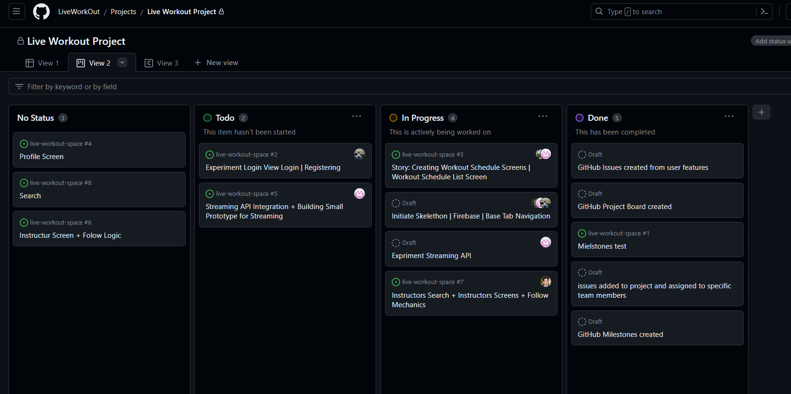
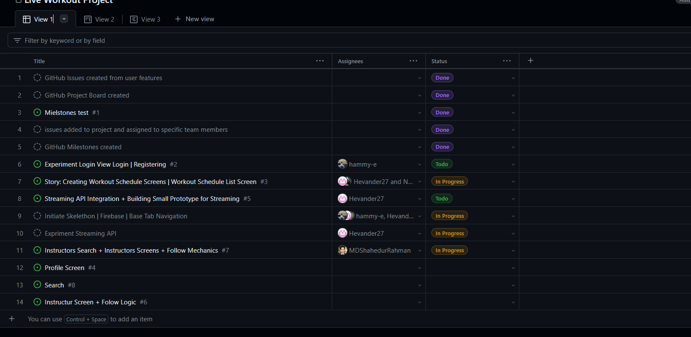
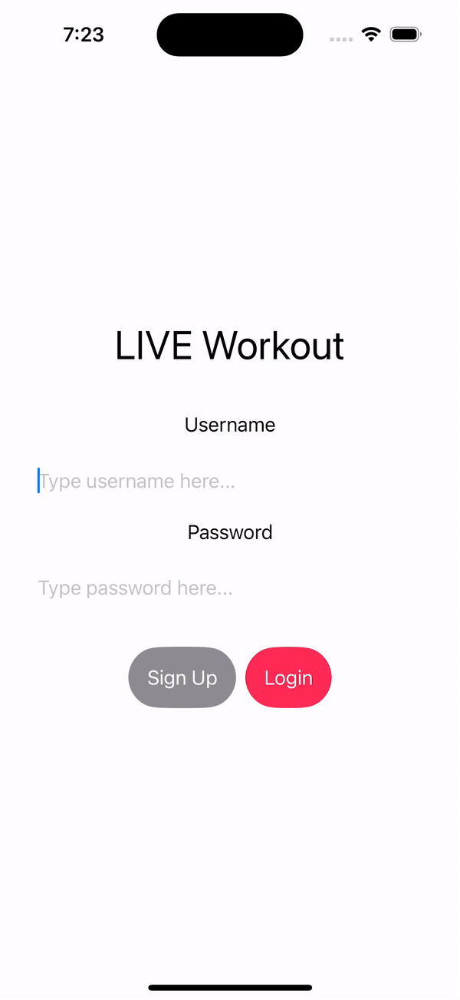
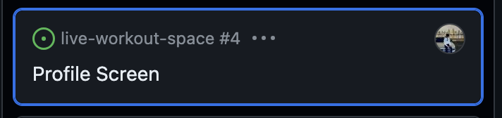
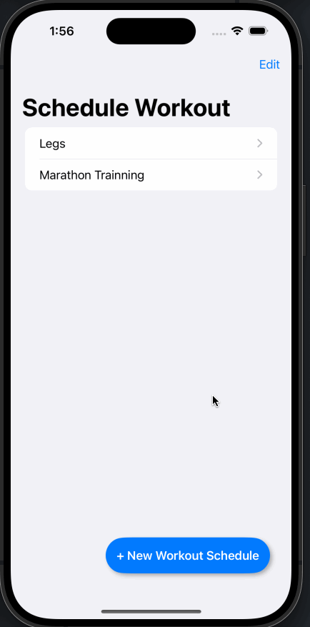
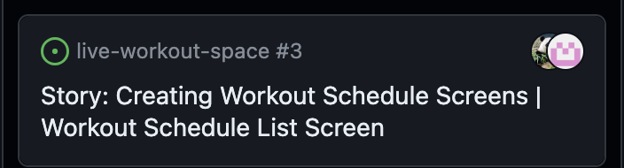
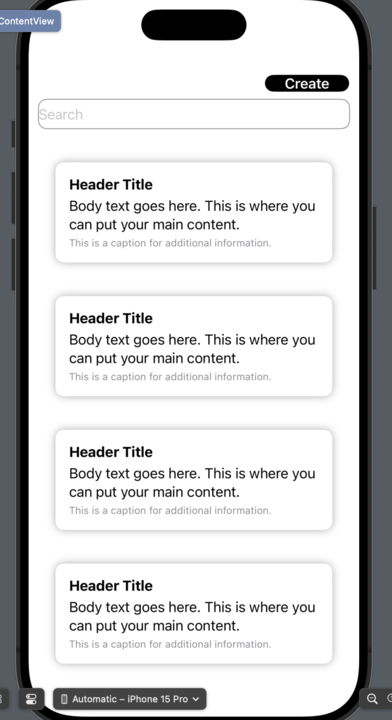
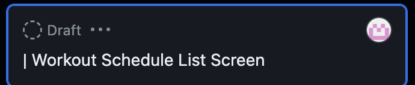
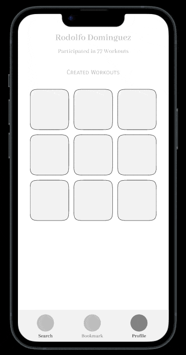

# Group #4 Sprint Planning 

> We are aware that `codepathreview` might not have access to our planning board, so we have some screenshots here

## Project Board and Issues

https://github.com/orgs/LiveWorkOut/projects/1/views/2

https://github.com/orgs/LiveWorkOut/projects/1/views/1

## Milestones

# Completed User Stories

### Workout Schedule Creation Story

| Story                                  | gif                                  | Storyboard |
| -------------------------------------- | ------------------------------------ | ---------- |
| Login  + Profile Story                 |          | 
| Schedule Workout Creation Screen Story |  | 
| Wokrout Schedule Screen Story          |    | 

## Completed user stories checked-off in README

## GIFs created to show build progress and added to README

# Live Workout Application

Figma Link: https://www.figma.com/file/3QqNP3MJXaWRzLeNhJlFTJ/Original-App-Design-Project?type=design&node-id=0%3A1&mode=design&t=CkHcBp2yqG9Q6qRA-1

Designed to facilitate real-time fitness classes and workouts.
Allowing users to participate in live sessions led by professional trainers and instructors.

## Table of Contents

1. [Overview](#Overview)
2. [Product Spec](#Product-Spec)
3. [Wireframes](#Wireframes)
4. [Schema](#Schema)

## Overview

### Description

Designed to facilitate real-time fitness classes and workouts.
Allowing users to participate in live sessions led by professional trainers and instructors.

### App Evaluation

- **Category:** Health, Video Streaming
- **Mobile:** Yes
- **Story:**  Our app revolutionizes workouts by bringing live workout sessions with professional trainers and other people around the world
- **Market:** People who want to live an active and healthy lifestyle
- **Habit:** Habit Use in the daily basis by a single user. Around 3-5 times a week for 20-45 minutes.
- **Scope:** Narrow Scope fitness streaming community

## Product Spec

### 1. User Stories (Required and Optional)

**Required Must-have Stories**

* User can watch Trainning Videos
* Users can track their trainning routine
* Set Stream Schedule time

**Optional Nice-to-have Stories**

* Ability to stream oneself
* Ability to connect with others
* Can design personalized workout routines

### 2. Screen Archetypes

* Login Screen
    * Archeotype: Login
    * Required Feature: User can log in using Google Authentication
* Streaming Screen
    * Archeotype: Detail
    * Required Feature: Be able to view the screens 
* Schedule Screen
    * Archeotype: List
    * Required Feature: Can View multiple Schedules
    * Requried Feature: Bookmark Bookmarked Schedules
* Schedule Create
    * Archeotype: Create
    * Required Feature: Able to program their workout Schedules
* Profile Screen
    * Archeotype: Profile
    * Required Feature: View Bookmarked Schedules
    * Required Feature: View Schedules you personally created.

### 3. Navigation

**Tab Navigation** (Tab to Screen)

- First Tab: **Search Screen**
  Second Tab: **Instructors Screen**
- Third Tab:  **Profile Screen**

**Flow Navigation** (Screen to Screen)

- Schedules Screen
  - => Open Modal => Go to Stream
- Instructor Modal Screen
  - => Stream Screen
- Profile
  - => Open Modal => Go to Stream

## Wireframes

## Schema 

### Models

User

| Property | Type   | Description                                 |
| -------- | ------ | ------------------------------------------- |
| email    | string | Email of the user                           |
| username | String | unique id for the user post (default field) |
| password | String | user's password for login authentication    |
| ...      | ...    | ...                                         |

Schedule

| Property    | Type     | Description                                 |
| ----------- | -------- | ------------------------------------------- |
| Title       | String   | unique id for the user post (default field) |
| StartTime   | datetime | Start time for the schedule                 |
| EndTime     | datetime | End time for the schedule                   |
| Description | String   | Description of the scheudle                 |
| ...         | ...      | ...                                         |

ActivityRecord

| Property   | Type     | Description                                 |
| ---------- | -------- | :------------------------------------------ |
| id         | String   | unique id for the user post (default field) |
| timestamp  | datetime | Time of the activity                        |
| workout_id | int      | the workout performed                       |
| ...        | ...      | ...                                         |

- Metadata to be defined

Workout

| Property    | Type                 | Description                                 |
| ----------- | -------------------- | ------------------------------------------- |
| id          | Int                  | unique id for workout                       |
| name        | Name of the exercise |
| sets        | String               | Count of sets                               |
| repetitions | int                  | Repetition count                            |
| time        | int                  | expected duration of the workout in seconds |
| weight      | Weight if applicable |
| ...         | ...                  | ...                                         |

